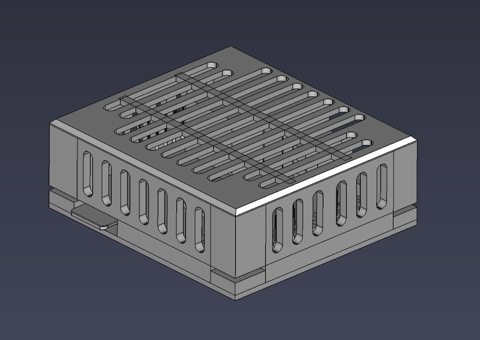

# opi-zero-3-case
3D printable housing (of sorts) for the Orange Pi Zero 3.

## Description

This is a 3D-printable housing for the OrangePi Zero 3 single board computer.  It was successfully printed on a Creality Ender 3 V2 out of PLA with 100% infill and no support rafts or adhesion skirt.

## Required to Complete

- 4 x M3*8 Machine Screws (aka 8mm M3 screws)

## Special Thanks

This project was slow-going until I stumbled across [@MotorBottle](https://github.com/MotorBottle)'s [OrangePi-Zero3-CAD-3D-Model](https://github.com/MotorBottle/OrangePi-Zero3-CAD-3D-Model) project in which they provided a 3D model of the Orange Pi Zero 3.  Before then the only thing I had figured out was the exact spacing of the mounting holes on the board, but was having trouble with my standoff posts not fitting.  Once I stumbled across their model it was smooth sailing.