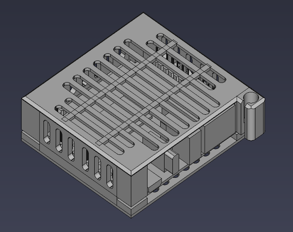
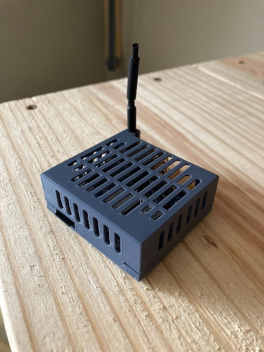
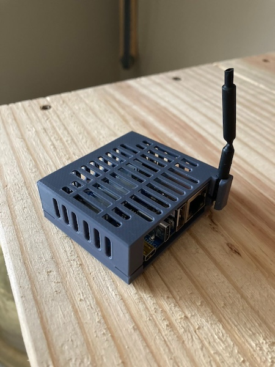
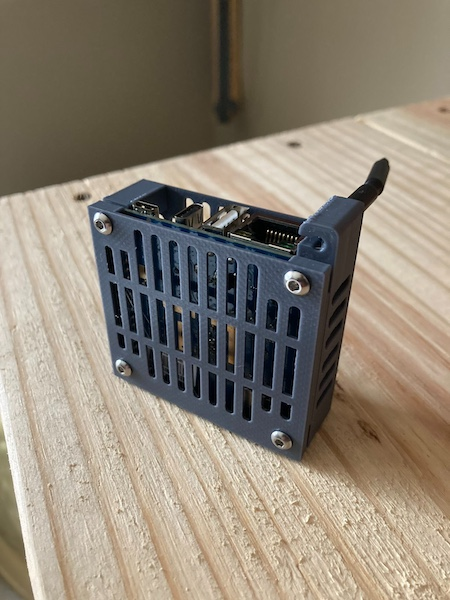

# opi-zero-3-case
3D printable housing (of sorts) for the Orange Pi Zero 3.

## Description

This is a 3D-printable vented housing for the OrangePi Zero 3 single board computer that offers protection for the components and GPIO pins while still allowing for the use of heatsinks. In addition it features a built-in holder for the WiFi antenna.

The two halves in ready-to-print STL format can be found here:

- [opi-zero-3-case/Printable_STLs/](./Printable_STLs/)

## Print Settings Used

- Monoprice PLA (Gray) 1.75mm Diameter
- 0.4mm Nozzle, 215˚C Hotend, 50˚C Glass Print Bed
- 0.2mm Resolution
- 100% Infill
- No Skirt, No Support Rafts

## Required to Complete

- 4 x M3*8 Machine Screws (aka 8mm M3 screws)

    > **A Note About Screw Threading...**
    > 
    > At least in my case, it turned out that a hole with a 1.45mm radius (2.9mm diameter) was optimal for the M3 screws' threads to engage with.  For the sections of the design that required a clean pass-through of the screws, a 1.9mm radius (3.8mm diameter) was used.  These values might need to be adjusted according due to printer, filament, and environmental influences.
    >
    > Why this is important: _my other projects utilized different values_.  It is my hope to one day figure out a more reliably consistent dimensions to use for threaded versus unthreaded sockets, but that's a project for another day.

## Images

## Special Thanks

This project was slow-going until I stumbled across [@MotorBottle](https://github.com/MotorBottle)'s [OrangePi-Zero3-CAD-3D-Model](https://github.com/MotorBottle/OrangePi-Zero3-CAD-3D-Model) project in which they provided a 3D model of the Orange Pi Zero 3.  Before then the only thing I had figured out was the exact spacing of the mounting holes on the board, but was having trouble with my standoff posts not fitting.  Once I stumbled across their model it was smooth sailing.